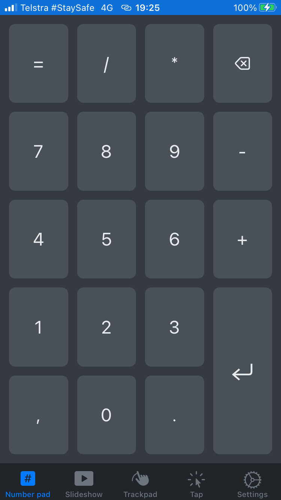
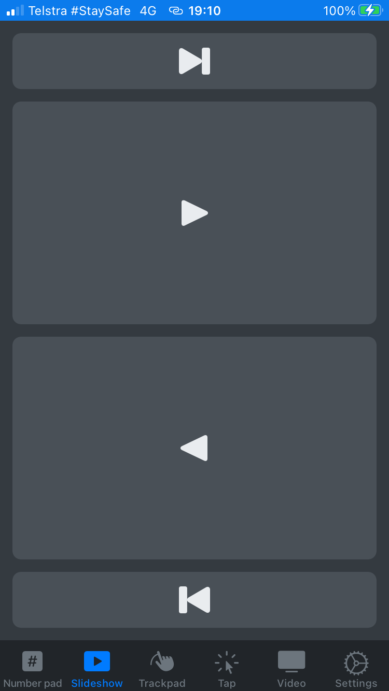
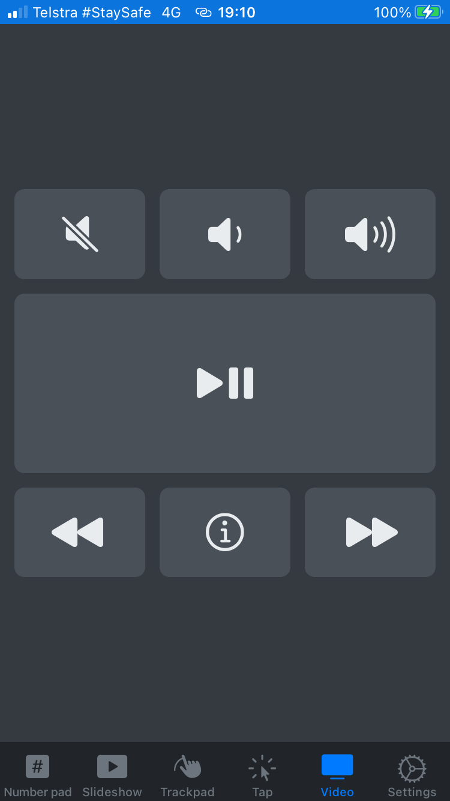
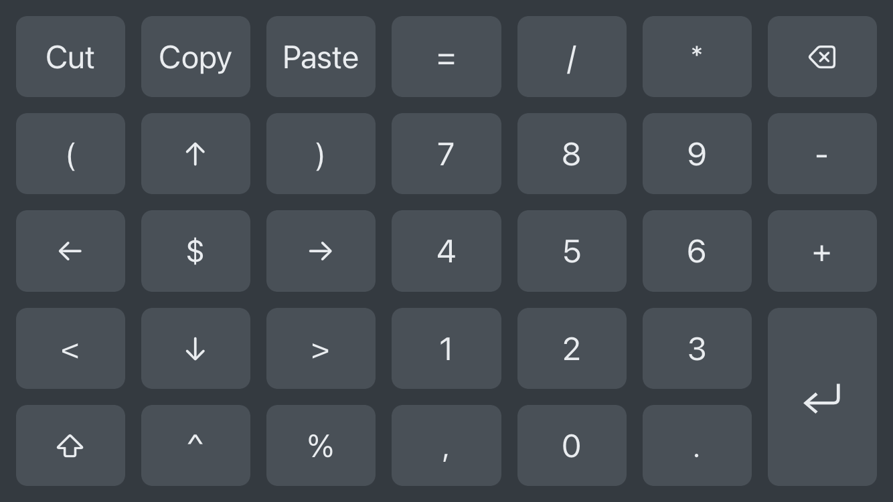

# The Fat Controller

TFC is a library for simulating mouse and keyboard events. Mouse movement, mouse
clicking, scrolling and key presses can all be simulated. The repo contains a
WebSocket server (soon to be a TCP server) that allows for remote control.
There's an iOS app that connects to the server to allow for remotely controlling
a host on the same WiFi network that's running the server.

<br/>

Currently, the library only supports macOS but other platforms may be added in
the future (perhaps with the help of some contributors 😉).

## Example

```rust
use tfc::*;
use std::{thread, time::Duration, f64::consts::PI};

fn main() -> Result<(), Error> {
    let mut ctx = Context::new()?;
    let radius = 100.0;
    let center = ctx.mouse_location()?;
    let center = (center.0 as f64 - radius, center.1 as f64);
    let steps = 200;
    let revolutions = 3;
    let delay = Duration::from_millis(10);

    for step in 0..steps * revolutions {
        thread::sleep(delay);
        let angle = step as f64 * 2.0 * PI / steps as f64;
        let x = (center.0 + radius * angle.cos()).round() as i32;
        let y = (center.1 + radius * angle.sin()).round() as i32;
        ctx.mouse_move_abs(x, y)?;
    }

    Ok(())
}
```

# iOS Remote app

See [docs/screenshots](docs/screenshots) for more.

<p align="center">
  
  
  
</p>

<p align="center">
  
</p>
